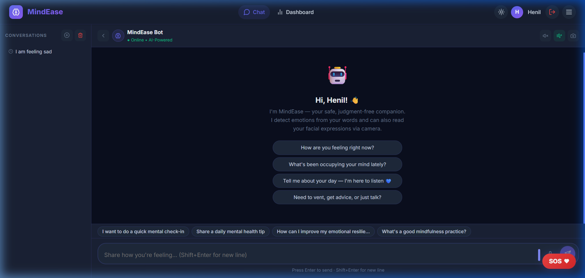
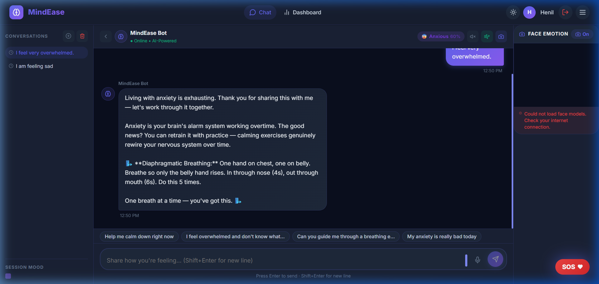
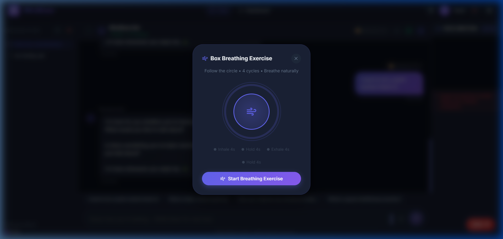
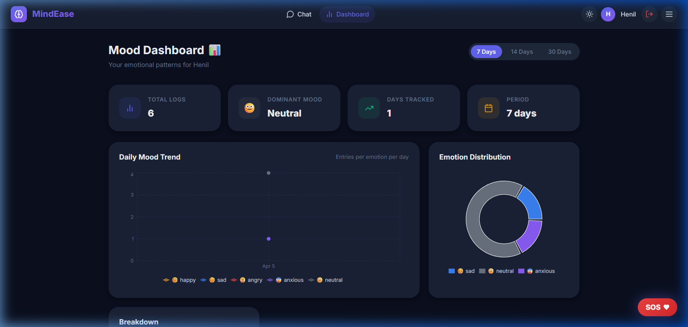

# 🧠 MindEase — AI Mental Health Chatbot

> A full-stack, AI-powered mental health chatbot with emotion detection, mood tracking, and crisis support.


---

## 📋 Table of Contents

- [Features](#features)
- [Tech Stack](#tech-stack)
- [Project Structure](#project-structure)
- [Quick Start](#quick-start)
- [API Reference](#api-reference)
- [Emotion Detection](#emotion-detection)
- [System Architecture](#system-architecture)
- [Deployment](#deployment)

## 📸 Project Screenshots

<details>
<summary><b>1. Clean, Modern Chat Interface & History Sidebar</b></summary>

</details>

<details>
<summary><b>2. Context-Aware AI & Insightful Responses</b></summary>

</details>

<details>
<summary><b>3. Built-In Box Breathing Exercise</b></summary>

</details>

<details>
<summary><b>4. Emotion Analytics & Mood Dashboard</b></summary>

</details>

---

## ✨ Features

### 🌟 Core Capabilities
| Feature | Description |
|---------|-------------|
| 🔐 **Auth** | Secure JWT-based signup/login with refresh tokens |
| 💬 **Chat** | Real-time chat UI with rich Markdown and conversation history |
| 🤖 **AI Support** | Highly empathetic, rule-based response engine (No costly API keys needed) |
| 📊 **Dashboard** | Visual analytics, daily/weekly mood tracking using Recharts |
| 🆘 **SOS Alert** | Automated crisis detection + hotline overlay mechanism |

### 🚀 Advanced Upgrades
| Advanced Feature | Description |
|---------|-------------|
| 📷 **Face Detection** | Uses `face-api.js` local processing to capture real-time webcam emotions |
| 🧠 **Fusion Engine** | Combines text sentiment (weight 60%) + facial expressions (40%) |
| 🌬️ **Breathing Widget** | Auto-triggers animated Box Breathing logic when user expresses anxiety |
| 🎙️ **Voice Synthesis** | In-browser Text-to-Speech allowing MindEase to read tips out loud |
| 💬 **Session Context** | Remembers the last 5 messages to provide highly contextual responses |
| 📉 **Mood Heuristics** | Sidebar heat strip and dynamic deterioration response mechanism |

---

## 🛠️ Tech Stack

```
Frontend  : React 18 + Vite + Recharts + React Router v6
Backend   : Node.js 20 + Express 4 + Mongoose + JWT
AI Service: Python 3.9+ + Flask + HuggingFace Transformers
Database  : MongoDB 7 (local)
```

---

## 📁 Project Structure

```
Mental Health Chatbot/
├── frontend/          # React + Vite (port 5173)
├── backend/           # Node.js + Express (port 5000)
├── ai-service/        # Python Flask (port 5001)
└── README.md
```

---

## 🚀 Quick Start

### Prerequisites

| Tool | Version | Download |
|------|---------|----------|
| Node.js | 18+ | [nodejs.org](https://nodejs.org) |
| Python | 3.9+ | [python.org](https://python.org) |
| MongoDB | Community 7 | [mongodb.com](https://www.mongodb.com/try/download/community) |

---

### Step 1 — Clone & Install

```bash
# Install backend dependencies
cd backend
npm install

# Install frontend dependencies
cd ../frontend
npm install

# Install Python AI service dependencies
cd ../ai-service
pip install -r requirements.txt
```

---

### Step 2 — Configure Environment

**Backend** (`backend/.env`):
```env
PORT=5000
NODE_ENV=development
MONGODB_URI=mongodb://localhost:27017/mindease
JWT_ACCESS_SECRET=your_super_secret_here_change_me
JWT_REFRESH_SECRET=another_super_secret_here
JWT_ACCESS_EXPIRES_IN=1h
JWT_REFRESH_EXPIRES_IN=7d
AI_SERVICE_URL=http://localhost:5001
FRONTEND_URL=http://localhost:5173
```

**AI Service** (`ai-service/.env`):
```env
PORT=5001
FLASK_DEBUG=true
# Use 'keyword' for offline mode (no model download):
EMOTION_MODEL=j-hartmann/emotion-english-distilroberta-base
```

> **💡 Tip:** Set `EMOTION_MODEL=keyword` for instant startup without downloading the 300MB HuggingFace model.

---

### Step 3 — Start MongoDB

```bash
# Windows — start as service (if installed as service)
net start MongoDB

# Or manually
"C:\Program Files\MongoDB\Server\7.0\bin\mongod.exe" --dbpath="C:\data\db"
```

---

### Step 4 — Start All Services

Open **3 terminal windows**:

**Terminal 1 — AI Service:**
```bash
cd ai-service
# Copy env file
copy .env.example .env
python app.py
```

**Terminal 2 — Backend:**
```bash
cd backend
# Copy env file and edit secrets
copy .env.example .env
npm run dev
```

**Terminal 3 — Frontend:**
```bash
cd frontend
npm run dev
```

Open **http://localhost:5173** in your browser 🎉

---

## 📡 API Reference

### Auth Endpoints
| Method | URL | Auth | Description |
|--------|-----|------|-------------|
| POST | `/api/auth/register` | ❌ | Register |
| POST | `/api/auth/login` | ❌ | Login |
| POST | `/api/auth/logout` | ❌ | Logout |
| GET  | `/api/auth/me` | ✅ | Current user |
| POST | `/api/auth/refresh` | Cookie | Refresh token |

### Chat Endpoints
| Method | URL | Auth | Description |
|--------|-----|------|-------------|
| POST | `/api/chat/message` | ✅ | Send message |
| GET  | `/api/chat/history` | ✅ | Get conversations list |
| GET  | `/api/chat/conversation/:id` | ✅ | Get full conversation |
| DELETE | `/api/chat/history` | ✅ | Clear all history |

### Mood Endpoints
| Method | URL | Auth | Description |
|--------|-----|------|-------------|
| GET | `/api/mood/logs?days=30` | ✅ | Raw mood logs |
| GET | `/api/mood/stats?days=7` | ✅ | Aggregated stats |

### AI Service Endpoints
| Method | URL | Description |
|--------|-----|-------------|
| POST | `/analyze` | `{ text }` → `{ emotion, score, isCrisis }` |
| POST | `/respond` | `{ text, emotion, score }` → `{ response }` |

---

## 🎭 Emotion Detection

MindEase uses a **two-tier** detection system:

### Tier 1 — HuggingFace Transformer (Primary)
- Model: `j-hartmann/emotion-english-distilroberta-base`
- Labels: joy → **happy**, sadness → **sad**, anger → **angry**, fear → **anxious**, neutral → **neutral**
- ~300MB download on first run

### Tier 2 — Keyword Classifier (Fallback / Offline)
- Zero dependencies, instant startup
- Matches emotion-specific keyword lists
- Set `EMOTION_MODEL=keyword` in `.env`

### Crisis Detection
Automatically triggers when text contains phrases like:
- "kill myself", "suicide", "want to die", "hurt myself", etc.
- Overrides emotion to `sad` with 0.95 confidence
- Displays helpline modal in the frontend

---

## 🗄️ Database Schema

### Users
```javascript
{ username, email, passwordHash, role, lastLogin, preferences, streakDays }
```

### Conversations
```javascript
{ userId, title, messages: [{ role, content, emotion, emotionScore, isCrisis }] }
```

### MoodLogs
```javascript
{ userId, emotion, score, sourceText, dateKey, isCrisis }
```

---

## 🏗️ System Architecture

```
Browser (React + Vite :5173)
        │ REST API calls
        ▼
Node.js / Express (:5000)
  ├── Auth (JWT)
  ├── Chat Controller
  │       │ calls
  │       ▼
  │   Python Flask (:5001)
  │     ├── HuggingFace Emotion Model
  │     └── Rule-Based Response Engine
  └── MongoDB (Atlas or local)
```

---

## 🆘 Emergency Resources

MindEase includes built-in crisis support resources for India:

| Helpline | Number | Hours |
|----------|--------|-------|
| iCall | 9152987821 | Mon–Sat |
| Vandrevala Foundation | 1860-2662-345 | 24/7 |
| Snehi | 044-24640050 | 24/7 |
| AASRA | 9820466627 | 24/7 |

---

## 🚢 Deployment

### Vercel (Frontend)
```bash
cd frontend
npm run build
# Upload dist/ to Vercel
```

### Railway / Render (Backend)
- Set environment variables in your hosting platform dashboard
- Point `MONGODB_URI` to MongoDB Atlas connection string

### PythonAnywhere / Railway (AI Service)
- Upload `ai-service/` directory
- Set `EMOTION_MODEL=keyword` to avoid large model download on free tier

---

## 📄 License

MIT License — feel free to use, modify, and share.

---

> ⚠️ **Disclaimer:** MindEase is not a substitute for professional mental health care. If you or someone you know is in crisis, please contact a helpline immediately.
